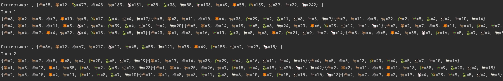
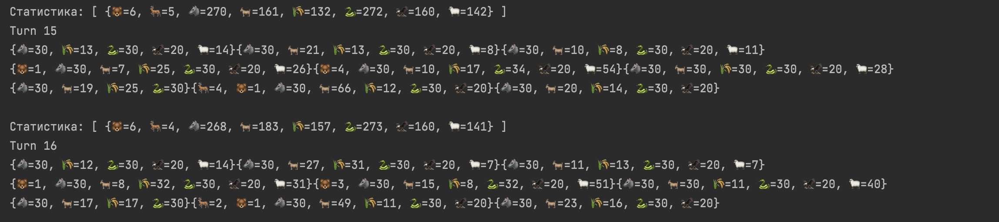

 # Predator & Prey Island 🏝️🐺🐑


 ## Задача — запрограммировать модель острова с изменяемыми параметрами, состоящую из массива локаций (например, 100х20 клеток). Локации будут заполнены растительностью и животными. 
 
 ### Животные могут:

* есть растения и/или других животных (если в их локации есть подходящая еда),
* передвигаться (в соседние локации),
* размножаться (при наличии пары в их локации),
* умирать от голода или быть съеденными.

 ### Иерархия животных:
 * Animal ->
 * -> Predator -> Anaconda, Bear, Eagle, Fox, Wolf
 * -> Prey     -> Aper, Buffalo, Deer, Duck, Goat, Horse, Larva, Mouse, Rabbit, Sheep

 ### Хранение характеристик:
 В классе enum Population:

 ```
WOLF (maxPopulationOnCell:30, movespeed: 3, maxSaturation: 8, weight: 50, moveForDead: 1,emoji: "\uD83D\uDC3A" ),
ANACONDA(maxPopulationOnCell:30, movespeed:1, maxSaturation: 3, weight 15, moveForDead: 1, emoji: "\uD83D\uDC0D") 
```
Характеристики из enum используются для инициализации животных и для работы в классах логики

 ## Запуск программы 
 ### Процесс запуска программы пока что производится в IntelliJ IDEA

 ## Примеры выполнения с размером острова 3*3
 ### Результат работы 1-2 ход
 
### Результат работы на 15-16 ход
 
 

 ## Troubleshooting:
 #### При большом количестве ячеек происходит нехватка памяти -> вываливается OutOfMemoryError exception. 
 #### Временное решение -> увеличить размер Heap

 ## To Do list
* Дописать метод eat для Duck, Aper, Mouse
* Сделать нормальный метод для насыщения животных -> наполнения насыщения в зависимости от съеденного веса животного/растения
* Приделать зависимость размножения от сытости - сытость больше половины - > размножаемся
* Сделать окончание программы в зависимости от условия
* Синхронизовать вывод - статистика + вывод острова -> при большом количестве ячеек острова, таски друг друга не ждут, нужно чтобы таска вывод статистики ждала выполнения таска симуляции животных
* Сделать больше статистики - вывод: общего количества животных|хищников|травоядных|травы
* Сделать общение с юзером для изменения настроек
* Вынести в отдельный класс логику движения + создание животных
* Сделать нормальную проверку на выход за пределы острова
* Сделать отдельную проверку, что животное|растение погибло


 